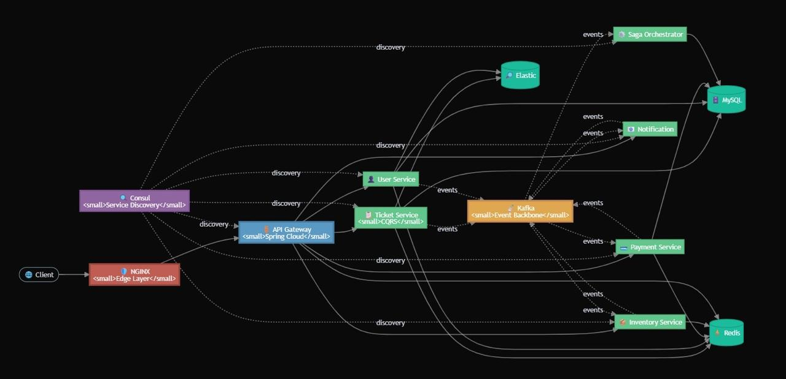

# Ticketing System

A production-ready, microservices-based distributed ticketing system built with Spring Boot, implementing event-driven architecture and the Saga pattern for distributed transaction management. This system provides a scalable, resilient solution for managing ticket booking operations across multiple services with comprehensive monitoring and observability.

## Description

The Ticketing System is designed to handle the complete lifecycle of ticket booking operations, from user registration and authentication to inventory management, payment processing, and notifications. The system employs modern architectural patterns including microservices, event-driven communication, CQRS, and distributed transaction orchestration to ensure consistency, reliability, and scalability.

Key architectural decisions focus on loose coupling between services, eventual consistency, and fault tolerance. Services communicate asynchronously through Kafka, ensuring high throughput and resilience to individual service failures.

## Architecture

The following diagram illustrates the high-level architecture of the ticketing system:



The architecture follows an event-driven microservices pattern with the following key components:

- **Client Layer**: External clients accessing the system
- **NGINX Edge Layer**: Load balancer and reverse proxy at the edge
- **API Gateway**: Spring Cloud Gateway routing requests to appropriate services
- **Microservices**: Independent services (User, Ticket, Payment, Inventory, Notification, Saga Orchestrator)
- **Kafka Event Backbone**: Central message broker for asynchronous event-driven communication
- **Service Discovery**: Consul for service registration and discovery
- **Data Stores**: MySQL for persistent storage, Redis for caching and distributed locking
- **Elastic**: Event processing for logging and analytics

## Features

- **Microservices Architecture**: Independent, scalable services with clear domain boundaries
- **Event-Driven Communication**: Asynchronous messaging via Apache Kafka for decoupled service interaction
- **Saga Pattern**: Distributed transaction orchestration with automatic compensation on failures
- **CQRS Implementation**: Command Query Responsibility Segregation in Ticket Service for optimized read/write operations
- **Service Discovery**: Consul-based service registration and discovery
- **API Gateway**: Single entry point with routing, load balancing, and circuit breaking
- **Resilience Patterns**: Circuit breakers, retries, and distributed locking for fault tolerance
- **Caching**: Redis-based caching and distributed locking for performance optimization
- **Monitoring & Observability**: Prometheus metrics collection and Grafana dashboards
- **Search & Analytics**: Elasticsearch integration for advanced search capabilities
- **Health Checks**: Comprehensive health endpoints for all services
- **API Documentation**: OpenAPI/Swagger documentation for all services
- **Containerization**: Docker and Docker Compose for easy deployment
- **Kubernetes Support**: Kubernetes manifests for production deployment

## Tech Stack

### Core Framework
- **Java 21**: Modern Java features and performance improvements
- **Spring Boot 3.2.0**: Application framework and runtime
- **Spring Cloud 2023.0.0**: Microservices patterns and integrations
- **Maven**: Build and dependency management

### Services & Communication
- **Spring Cloud Gateway**: Reactive API gateway
- **Apache Kafka**: Event streaming and messaging
- **Spring Kafka**: Kafka integration for event-driven communication

### Data Storage
- **MySQL 8.0**: Primary relational database
- **Spring Data JPA**: Data persistence layer
- **Redis 7**: Caching and distributed locking
- **Elasticsearch 8.11.0**: Search and analytics engine

### Service Discovery & Configuration
- **Consul**: Service discovery and configuration management

### Resilience & Observability
- **Resilience4j**: Circuit breaker, retry, and rate limiting
- **Spring Actuator**: Application monitoring and management
- **Micrometer**: Metrics abstraction
- **Prometheus**: Metrics collection and storage
- **Grafana**: Metrics visualization and dashboards

### Infrastructure
- **Docker**: Containerization
- **Docker Compose**: Multi-container orchestration
- **Nginx**: Load balancer and reverse proxy
- **Kubernetes**: Container orchestration (optional)

### Documentation
- **SpringDoc OpenAPI**: API documentation generation
- **Swagger UI**: Interactive API documentation

## Project Structure

```
ticketing-system/
├── api-gateway/              # API Gateway service (Spring Cloud Gateway)
├── ticket-service/           # Ticket management service (CQRS pattern)
├── user-service/             # User management service
├── payment-service/          # Payment processing service
├── notification-service/     # Notification service
├── inventory-service/        # Inventory and seat reservation service
├── saga-orchestrator-service/ # Saga orchestration service
├── common-event-library/     # Shared event models and DTOs
├── k8s/                      # Kubernetes deployment manifests
│   ├── deployments/          # Service deployments
│   ├── services/             # Service definitions
│   ├── ingress/              # Ingress configurations
│   └── autoscaling/          # HPA configurations
├── nginx/                    # Nginx configuration
├── grafana/                  # Grafana provisioning
├── docker-compose.yml        # Docker Compose configuration
├── prometheus.yml            # Prometheus configuration
└── init-db.sql              # Database initialization script
```

## Installation

### Prerequisites

- **Java 21** or higher
- **Maven 3.6+**
- **Docker** and **Docker Compose**
- **Git**

### Step-by-Step Installation

1. **Clone the repository:**
   ```bash
   git clone <repository-url>
   cd ticketing-system
   ```

2. **Build the project:**
   ```bash
   mvn clean install
   ```

3. **Start infrastructure services:**
   ```bash
   docker-compose up -d consul mysql kafka redis elasticsearch prometheus grafana kibana zookeeper
   ```

4. **Wait for services to be healthy:**
   ```bash
   docker-compose ps
   docker-compose logs -f
   ```

5. **Start application services:**
   ```bash
   docker-compose up -d
   ```

## Usage

### Running the Application

#### Option 1: Docker Compose (Recommended for Development)

Start all services with Docker Compose:

```bash
docker-compose up -d
```

View logs:

```bash
docker-compose logs -f
```

Stop all services:

```bash
docker-compose down
```

Stop and remove volumes (cleans database data):

```bash
docker-compose down -v
```

#### Option 2: Individual Service Execution

1. Start infrastructure services:
   ```bash
   docker-compose up -d consul mysql kafka redis elasticsearch prometheus grafana
   ```

2. Build and run each service individually:
   ```bash
   cd api-gateway
   mvn clean install
   mvn spring-boot:run
   ```

   Repeat for other services: `ticket-service`, `user-service`, `payment-service`, `notification-service`, `inventory-service`, `saga-orchestrator-service`.

### Service Endpoints

All services are accessible through the API Gateway at `http://localhost:8080`:

- **Tickets**: `http://localhost:8080/tickets/**`
- **Users**: `http://localhost:8080/users/**`
- **Payments**: `http://localhost:8080/payments/**`
- **Notifications**: `http://localhost:8080/notifications/**`
- **Inventory**: `http://localhost:8080/inventory/**`

### Direct Service Access

Individual services are available on their respective ports:

- **API Gateway**: http://localhost:8080
- **Ticket Service**: http://localhost:8081
- **User Service**: http://localhost:8082
- **Payment Service**: http://localhost:8083
- **Notification Service**: http://localhost:8084
- **Inventory Service**: http://localhost:8085
- **Saga Orchestrator Service**: http://localhost:8086

### API Documentation

Access Swagger UI for interactive API documentation:

- **API Gateway**: http://localhost:8080/swagger-ui.html
- **Ticket Service**: http://localhost:8081/swagger-ui.html
- **User Service**: http://localhost:8082/swagger-ui.html
- **Payment Service**: http://localhost:8083/swagger-ui.html
- **Notification Service**: http://localhost:8084/swagger-ui.html
- **Inventory Service**: http://localhost:8085/swagger-ui.html

### Monitoring & Observability

- **Consul UI**: http://localhost:8500 (Service discovery and health)
- **Prometheus**: http://localhost:9090 (Metrics)
- **Grafana**: http://localhost:3000 (Default credentials: admin/admin)
- **Kibana**: http://localhost:5601 (Elasticsearch UI)

### Health Checks

All services expose health endpoints via Spring Actuator:

- **API Gateway**: http://localhost:8080/actuator/health
- **Ticket Service**: http://localhost:8081/actuator/health
- **User Service**: http://localhost:8082/actuator/health
- **Payment Service**: http://localhost:8083/actuator/health
- **Notification Service**: http://localhost:8084/actuator/health
- **Inventory Service**: http://localhost:8085/actuator/health
- **Saga Orchestrator Service**: http://localhost:8086/actuator/health

## Configuration

### Application Configuration

Each service contains its own `application.yml` file in `src/main/resources/`. Key configuration areas include:

- **Server ports**: Configured per service (8080-8086)
- **Database connections**: MySQL connection strings and credentials
- **Kafka settings**: Bootstrap servers and topic configurations
- **Redis configuration**: Host, port, and connection timeouts
- **Consul discovery**: Service registration settings
- **Circuit breaker**: Resilience4j circuit breaker configurations
- **Actuator endpoints**: Health, metrics, and Prometheus exposure

### Database Configuration

Databases are automatically created on first startup via `init-db.sql`:

- `ticketdb` - Ticket Service database
- `userdb` - User Service database
- `paymentdb` - Payment Service database
- `notificationdb` - Notification Service database
- `inventorydb` - Inventory Service database

### Environment Variables

For production deployments, configure the following environment variables:

#### Database
- `MYSQL_ROOT_PASSWORD` - MySQL root password
- `MYSQL_HOST` - MySQL host address
- `MYSQL_PORT` - MySQL port (default: 3306)

#### Kafka
- `KAFKA_BOOTSTRAP_SERVERS` - Kafka bootstrap servers (default: kafka:9092)
- `KAFKA_ZOOKEEPER_CONNECT` - Zookeeper connection string

#### Redis
- `REDIS_HOST` - Redis host (default: redis)
- `REDIS_PORT` - Redis port (default: 6379)

#### Consul
- `CONSUL_HOST` - Consul host (default: consul)
- `CONSUL_PORT` - Consul port (default: 8500)

#### Elasticsearch
- `ELASTICSEARCH_URIS` - Elasticsearch connection URIs (default: http://elasticsearch:9200)

#### Prometheus
- `PROMETHEUS_ENABLED` - Enable Prometheus metrics (default: true)

## Scripts / Commands

### Maven Commands

Build all services:
```bash
mvn clean install
```

Build a specific service:
```bash
cd <service-directory>
mvn clean install
```

Run a service:
```bash
mvn spring-boot:run
```

### Docker Commands

Start all services:
```bash
docker-compose up -d
```

Start specific services:
```bash
docker-compose up -d consul mysql kafka redis
```

View service logs:
```bash
docker-compose logs -f <service-name>
```

View all logs:
```bash
docker-compose logs -f
```

Stop all services:
```bash
docker-compose down
```

Rebuild and restart:
```bash
docker-compose up -d --build
```

### Health Check Commands

Check service health:
```bash
curl http://localhost:8080/actuator/health
```

Check Consul services:
```bash
curl http://localhost:8500/v1/agent/services
```

## Testing

The project structure supports comprehensive testing. Each service can include unit tests, integration tests, and end-to-end tests.

### Running Tests

Run all tests:
```bash
mvn test
```

Run tests for a specific service:
```bash
cd <service-directory>
mvn test
```

### Test Coverage

Generate test coverage reports:
```bash
mvn clean test jacoco:report
```

Coverage reports are generated in `target/site/jacoco/index.html` for each service.

## Deployment

### Docker Compose Deployment

For development and testing environments, use Docker Compose:

```bash
docker-compose up -d
```

### Kubernetes Deployment

The project includes Kubernetes manifests in the `k8s/` directory for production deployment.

1. **Create namespace:**
   ```bash
   kubectl apply -f k8s/namespace.yaml
   ```

2. **Deploy services:**
   ```bash
   kubectl apply -f k8s/deployments/
   kubectl apply -f k8s/services/
   ```

3. **Configure ingress:**
   ```bash
   kubectl apply -f k8s/ingress/
   ```

4. **Set up autoscaling (optional):**
   ```bash
   kubectl apply -f k8s/autoscaling/
   ```

### Production Considerations

- Use external MySQL, Kafka, Redis, and Elasticsearch clusters
- Configure proper secrets management (Kubernetes Secrets, HashiCorp Vault)
- Set up proper monitoring and alerting
- Configure resource limits and requests
- Enable TLS/SSL for all external communications
- Implement proper backup strategies for databases
- Configure log aggregation (ELK stack, Loki, etc.)
- Set up CI/CD pipelines for automated deployments

## Architecture Patterns

### Event-Driven Architecture

Services communicate asynchronously through Kafka topics:

- `ticket-created` - Published when a ticket is created
- `ticket-confirmed` - Published when a ticket is confirmed
- `ticket-cancelled` - Published when a ticket is cancelled
- `payment-initiated` - Published when payment is initiated
- `payment-completed` - Published when payment succeeds
- `payment-failed` - Published when payment fails
- `user-created` - Published when a user is created

### Saga Pattern

The Saga Orchestrator coordinates distributed transactions:

1. Receives `TicketCreatedEvent`
2. Coordinates payment processing
3. Handles compensation on failures
4. Manages saga state and recovery

### CQRS Pattern

Ticket Service implements Command Query Responsibility Segregation:

- **Commands**: CreateTicketCommand, CancelTicketCommand, UpdateTicketStatusCommand
- **Queries**: Separate read models optimized for querying

### Resilience Patterns

- **Circuit Breaker**: Prevents cascading failures (Resilience4j)
- **Retry**: Automatic retry for transient failures
- **Distributed Locking**: Redis-based locking for inventory operations
- **Caching**: Redis caching for frequently accessed data

## Contributing

Contributions are welcome! Please follow these guidelines:

1. Fork the repository
2. Create a feature branch (`git checkout -b feature/amazing-feature`)
3. Commit your changes (`git commit -m 'Add some amazing feature'`)
4. Push to the branch (`git push origin feature/amazing-feature`)
5. Open a Pull Request

### Development Guidelines

- Follow Java coding standards and best practices
- Write unit tests for new features
- Update documentation as needed
- Ensure all tests pass before submitting PR
- Follow the existing code style and architecture patterns

## License

This project is proprietary software. All rights reserved.

---

For questions or support, please contact the development team.
